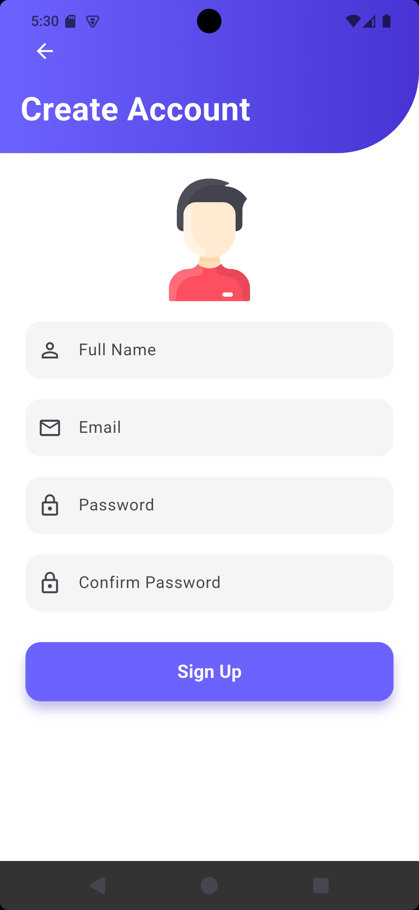

# Modern Authentication UI - Flutter Assignment

A responsive User Interface for a Login, Register, and Forgot Password flow built with Flutter. This project demonstrates clean UI design principles, input validation, and efficient state management.

## 📱 App Screenshots

|                 Login Screen                  |                 Register Screen                  |                Forgot Password                 |
|:---------------------------------------------:|:------------------------------------------------:|:----------------------------------------------:|
|  |  |  |

## 🛠 Tech Stack
* *Framework:* Flutter
* *Language:* Dart

## 💡 Key Features & Code Explanation

### 1. Global Theming (main.dart)
Instead of styling every single text box manually, I implemented a global *ThemeData* in main.dart.
* *Why:* This follows the *DRY (Don't Repeat Yourself)* principle.
* *How:* By defining inputDecorationTheme globally, all text fields across the app automatically inherit the same rounded corners, grey fill color, and border styles.

### 2. Form Validation
I used GlobalKey<FormState> and TextFormField instead of basic TextFields.
* *Why:* To ensure data integrity before processing.
* *How:* The login button checks _formKey.currentState!.validate() to ensure the email and password fields are not empty before proceeding.

### 3. Modern UI Design
The interface moves away from standard Material Design to a custom, polished look.
* *Gradients:* Used LinearGradient in the header containers for a modern aesthetic.
* *Shadows:* Applied elevation and shadowColor with Color.withValues(alpha: 0.5) to buttons for depth.
* *Assets:* Integrated custom vector illustrations for better visual storytelling.

### 4. Navigation
Used Navigator.push() for smooth transitions between the Login, Register, and Forgot Password screens.

---
Created by John Beloved Osemegbe Oregbemhe for [CSC 315]